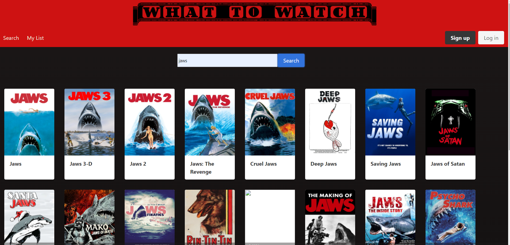

# What To Watch


## Overview
Have you ever got off of work and didn't know what to watch? Or had a friend or family suggest that you watch a movie or tv show and you didn't write down or have them text it to you? We have the answer: just open our app up and search for the movie or tv show and then you can ask them what it is and show them and then add it to your list and then you can watch it later when you have nothing else to watch or the time to.

## Installion
make sure you have node.js already installed also you will need to install mongoose:

```
npm i mongoose
```

and dotenv

```
npm i dotenv
```

and express.js, the session and path
```
npm i express express-session path
```
and axios, bcrypt, if-env
```
npm i axios bcrypt if-env
``` 

## Wireframe
https://www.figma.com/file/OS1pHI02fjtRalUlfcoKR3/Untitled?node-id=1%3A33 

## Project Details
https://docs.google.com/document/d/1aKxXPPxK8vvqaU2r37uaHOsqr2TuurPqoZz5__4PpaM/edit?usp=sharing

## Screenshot of landing page


## Api 
https://developers.themoviedb.org/3/movies/get-movie-watch-providers

## Link to Deployed App
